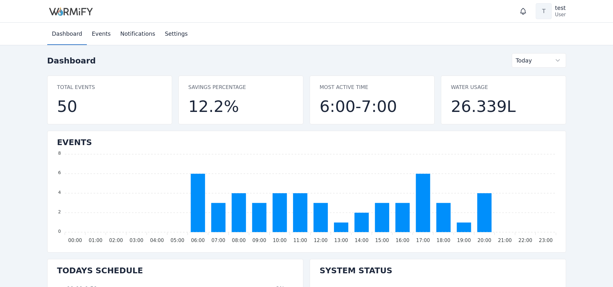

# Warmify dashboard

A web-based dashboard for the Warmify smart heating system. Part of my teams project in our univesties senior project course.

## Motiviation

Most traditional water heaters run 24/7, only turning off after reaching a specific temperature, only to turn on again after some time. This is very inefficient and might result in high electricity usage.

Our solution attempts to solve this problem by running the water heater only when you need it. All you have to do is set up the system and use it. The system will figure out the times when you use water and automatically turn the heater on at those times.

## Technologies

- Django
- Tabler
- HTMX

## Development setup

- (optional) create virtual environment and activate it
- clone project and change directory to `warmify`
- install dependencies

`pip install -r requirements.txt`
- create database tables 

`python manage.py migrate `
- create superuser 

`python manage.py createsuperuser `

- run server

`python manage.py runserver `

- run celery worker (you will need to install rabbitmq)

`celery -A warmify worker --loglevel=INFO`